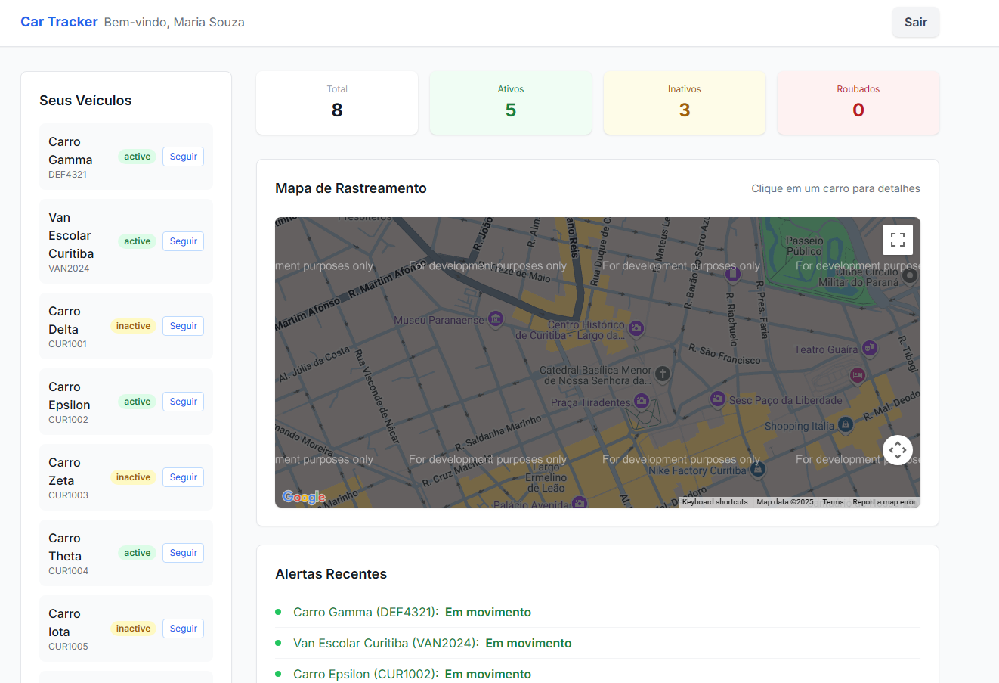
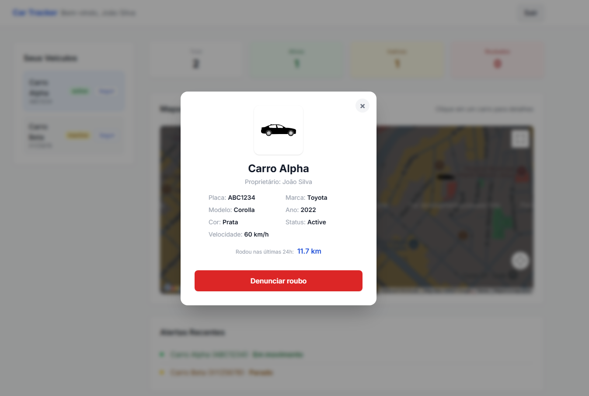
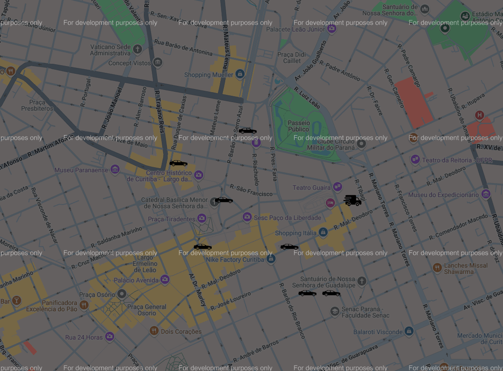
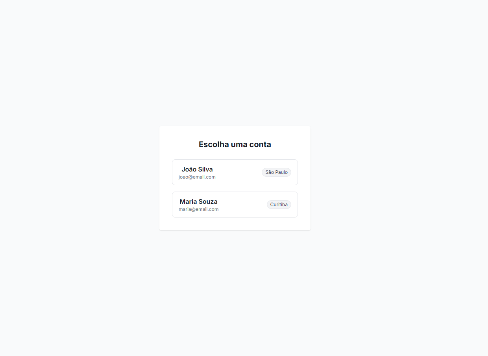

# Car Tracker

Sistema fullstack de rastreamento de veículos em tempo real

## 📸 Screenshots


_Dashboard principal com mapa interativo e lista de veículos_


_Modal com detalhes completos do veículo selecionado_


_Interface de seleção de conta e login_


_Versão responsiva para dispositivos móveis_

## 🚗 Funcionalidades

- Dashboard responsivo com Next.js (React) e Node.js/Express
- Mapa interativo com Google Maps (carros animados, van escolar com ícone especial)
- Simulação de múltiplos usuários (São Paulo e Curitiba)
- Seleção de conta com login automático
- Lista de veículos com status (active, inactive, stolen)
- Botão "Seguir" para acompanhar o movimento de qualquer veículo
- Modal de detalhes com informações completas e km rodados nas últimas 24h
- Denúncia de roubo (muda status e cor do marcador)
- Cards de resumo e alertas recentes
- Totalmente responsivo (funciona em mobile/tablet)

## 🚀 Como rodar localmente

1. Clone o repositório
2. Instale as dependências:
   ```bash
   cd frontend && npm install
   cd ../backend && npm install
   ```
3. Configure a chave do Google Maps em `frontend/.env.local`:
   ```
   NEXT_PUBLIC_GOOGLE_MAPS_API_KEY=SUA_CHAVE_AQUI
   ```
4. Rode o sistema:
   ```bash
   cd ..
   npm run dev
   ```
5. Acesse em [http://localhost:3000](http://localhost:3000) (ou porta sugerida)

## 🛠️ Tecnologias

- Next.js 14 (React)
- Node.js + Express
- Google Maps API
- TailwindCSS
- TypeScript

## 💡 Possíveis melhorias

- Deploy online (Vercel, Render, etc.)
- Histórico de rotas real
- Upload de foto real do veículo
- Exportação de dados
- Testes automatizados

---

Projeto desenvolvido para fins de estudo e portfólio. Sinta-se à vontade para customizar e evoluir!
